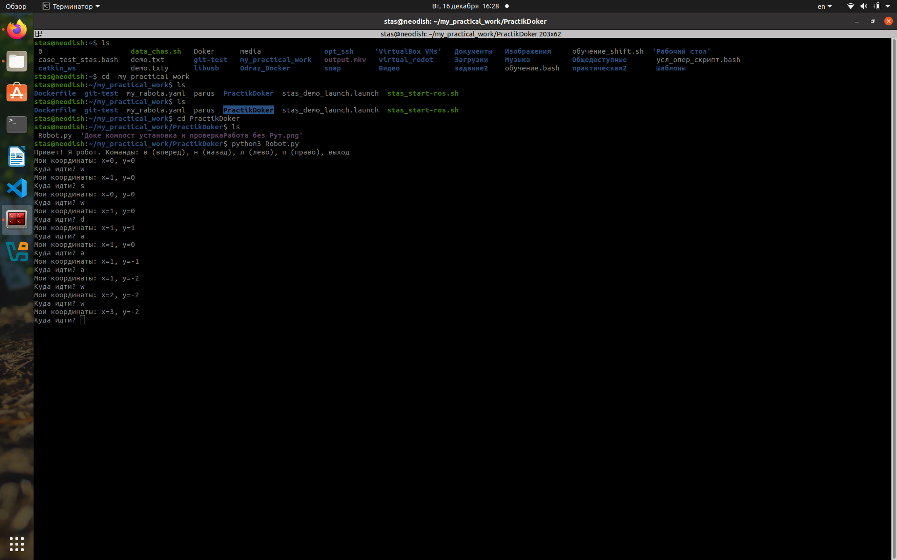
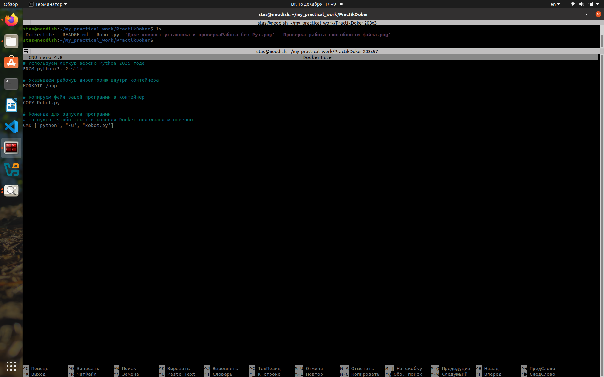
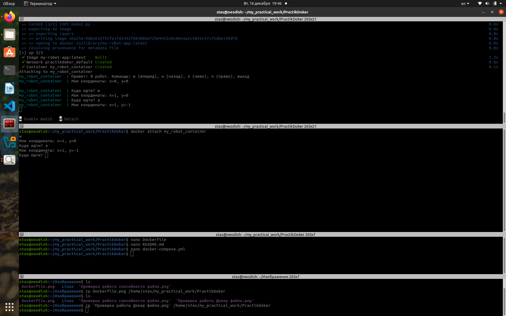

**Установка Docker и Docker Compose**

**Разработка простой программы**

1. *Robot.py*
2. 
3. *Создание репозитория для проекта*

**Создание Docker-образа для программы**

1. *Создайте Dockerfile для сборки образа*
2. 
3. *Проверка Docker-образа*
4. *Запуск и тестирование Python-приложения в Docker-контейнере*
5. 

**Работа с Docker Compose**

- docker-compose.yml
- Сборка и запуск
- Подключение к консоли
- 
